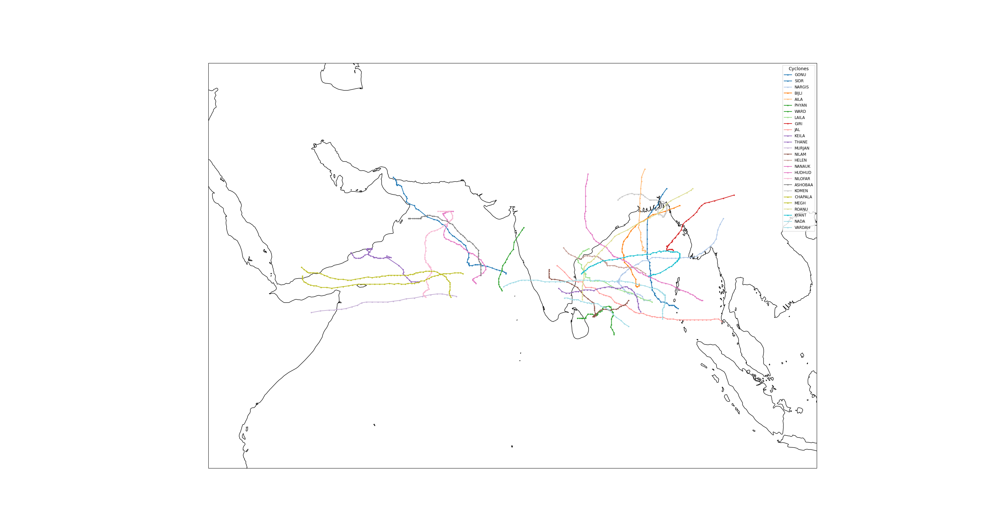
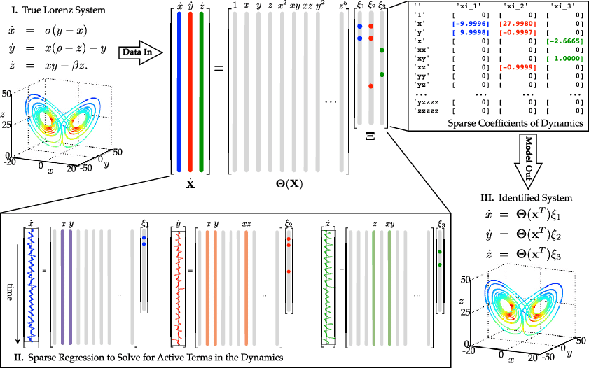

# Table of Contents
Tropical Cyclone Track Modelling using Sparse Identification of Nonlinear Dynamics on satellite imagery from the METEOSAT-7 IODC campaign (2007-2016)

NOTE : WiP, needs to be finalized.

- [Table of Contents](#table-of-contents)
- [**Abstract**](#abstract)
- [**Inspiration**](#inspiration)
- [**Dataset Construction**](#dataset-construction)
  - [Satellite Image Download](#satellite-image-download)
  - [Cyclone Position](#cyclone-position)
  - [Lat-Lon to Pixel Look-Up Table](#lat-lon-to-pixel-look-up-table)
  - [Wind Velocity Vector](#wind-velocity-vector)
  - [Note:](#note)
  - [Final Merged Dataset](#final-merged-dataset)
- [**Modelling**](#modelling)
  - [SINDy Overview](#sindy-overview)
  - [TC System](#tc-system)
  - [Output](#output)
  - [To Do:](#to-do)

# **Abstract**
This project investigates the use of Sparse Identification of Nonlinear Dynamics (SINDy) to model tropical cyclone tracks using satellite imagery from the METEOSAT-7 Indian Ocean Data Coverage (IODC) campaign, covering the period from 2007 to 2016. The METEOSAT-7 geostationary satellite provides continuous, high-temporal-resolution imagery over the Indian Ocean basin, enabling detailed observation of tropical cyclones. From the imagery, key physical variables such as Brightness Temperature and Wind Vectors are derived and used to characterize cyclone structure and motion. These features form the basis for constructing data-driven dynamical models using the SINDy framework, which identifies sparse, interpretable representations of the underlying nonlinear dynamics. Despite the sparsity and variability inherent in satellite-derived measurements, the approach captures the evolution of cyclone tracks across multiple events. The resulting models presents a promising avenue for enhancing tropical cyclone forecasting capabilities, by bridging the gap between data-driven and physics-based models.

# **Inspiration**

This project was inspired by [this paper](https://www.sciencedirect.com/science/article/abs/pii/S0167610524001211). The authors attempted to model tropical cyclone tracks using SINDy for the WNP and NA basins. Their dataset was constructed with [CMA Best Tracks Dataset](https://tcdata.typhoon.org.cn/en/zjljsjj.html) for WNP at 6hr resolution, [IBTrACS](https://www.ncei.noaa.gov/products/international-best-track-archive) for NA at 3 hr resolution, and [ERA5](https://cds.climate.copernicus.eu/datasets/reanalysis-era5-single-levels?tab=overview) for environment variables on a 0.25° grid at a 6hr resolution for SST, RH, Tropopause Temperature and wind speeds at 850, 500 and 200 hPa. They also used extensive samples, from 1979-2018 to construct their train-test-val datasets.

This project attempts to visit this problem from a different perspective, by only using data that can directly be infered by geostationary satellite imagery on a 0.1° grid for the NI basin, on cyclones from 2007-2016.

# **Dataset Construction**
The code for this can be found in the `reprocessing/` folder.
The dataset is created through the following steps:

## Satellite Image Download

The raw images were downloaded from [EUMETSAT](https://data.eumetsat.int/product/EO:EUM:DAT:0081) [(alt)](https://navigator.eumetsat.int/product/EO:EUM:DAT:0081) and further processed to generate the training dataset. The images have three channels [(page 11)](https://user.eumetsat.int/s3/eup-strapi-media/pdf_mviri_fcdr_atbd_75cac1f577.pdf)

- IR 108 (InfraRed at 11500 nm)
- VIS 6 (VISible at 700 nm)
- WV 73 (WaterVapour 6400 nm)

14,543 images were downloaded to create the dataset.

## Cyclone Position

The [IBTrACS dataset](https://www.ncei.noaa.gov/data/international-best-track-archive-for-climate-stewardship-ibtracs/v04r01/access/csv/) was used to get the coordinates for the cyclones. These samples are available at a 3hr resolution, and there are 1286 samples in the dataset.

## Lat-Lon to Pixel Look-Up Table

A look-up table was created using CartoPy to identify the pixel in the image that corresponded to the latitude and longitude values obtained from IBTrACS. This was then used to create the geodesic circles (small circle), and the annuli masks of subsequent geodesic circles around the centre of the cyclone. The Wind Velocity Vectors and Brightness Temperatures are averaged in these bands.

## Wind Velocity Vector

Wind velocity vectors are calculated by computing the optical flow between two subsequent images, and averaging them across each geodesic band in both WV and IR wavelengths.

## Note:
Brightness temperature from [Planck's law](https://www-cdn.eumetsat.int/files/2020-04/pdf_ten_052556_rad2bright.pdf) and Celestial Information (time of day, day of year and phase of the moon encoded as sine waves) are also present, but are not currently being used currently. They play a stronger role in intensity forecasting than trajectory modelling, and are hence ignored for now.

## Final Merged Dataset
The final merged dataset was created by merging the records from the velocity bands, brightness temperatures and celestial information. The final dataset has 1190 rows.

The ground-truth tracks are as follows:

# **Modelling**

## SINDy Overview
In general, a [SINDy model](https://www.pnas.org/doi/10.1073/pnas.1517384113) is constructed as follows:

For a data matrix $X$ of feature measurements, we assume the nonlinear dynamics of the system are captured by a feature library $\Theta(X)$ that satisfies the equation $\dot{X} = \Theta(X) \cdot \Xi$, where $\Xi$ is the sparse coefficient matrix. For the Lorentz system, this is what it looks like. 

(Illustration of the SINDy algorithm used on the Lorenz system. Credit to Brunton, Proctor, and Kutz.)

## TC System

From [this paper](https://journals.ametsoc.org/view/journals/clim/33/18/jcliD200285.xml), we can see that the position of the cyclone at a given timestep can be calculated using the formula:

$x_{n+1} = x_n + ( U - W_\beta [ 1 + \exp(\gamma ( \frac{\partial U}{\partial y} + \frac{\partial V}{\partial x}))] )\Delta T$

$y_{n+1} = y_n + ( V + W_\beta [ 1 + \exp(\gamma ( \frac{\partial U}{\partial y} + \frac{\partial V}{\partial x}))] )\Delta T$

Where $W_\beta$ is the beta drift velocity, $U$ and $V$ are zonal and meridonal components of environmental flow, $\gamma$ is scaling constant, and $( \frac{\partial U}{\partial y} + \frac{\partial V}{\partial x})$ represents the horizontal sheer component of environmental flow.

Since we do not possess the values of horizontal sheer directly, it is assumed to be a combination of the velocity bands for candidate library construction.

From this, we can define the following differential equations of motion:

$\frac{dx}{dt} = U - W_\beta (1 + \exp(\gamma  ( \frac{\partial U}{\partial y} + \frac{\partial V}{\partial x})))$

$\frac{dy}{dt} = V + W_\beta (1 + \exp(\gamma  ( \frac{\partial U}{\partial y} + \frac{\partial V}{\partial x})))$

Similarly from [this paper](https://journals.ametsoc.org/view/journals/bams/87/3/bams-87-3-299.xml) we get the relation,

$V_{track} = \alpha V_{850} + (1-\alpha) V_{250} + V_\beta$

Where $V_{850}$ and $V_{250}$ are the vector flows at the 850 and 250 hPa pressure levels respectively.

Since we do not have the exact or accurate values of $V_{850}$ and $V_{250}$ either, they are also assumed to be a combination of the velocity bands for candidate library construction.

Hence, in expanded form, the equation of motion for the cyclone can be approximated as:

$\frac{dx}{dt} = \alpha F(U_{wv}) + (1-\alpha) G(U_{ir}) - W_{\beta} - W_{\beta} e^\gamma \exp(H(\frac{dU_{wv}}{dV_{wv}}, \frac{dU_{ir}}{dV_{ir}}))$ 

$\frac{dy}{dt} = \alpha F(U_{wv}) + (1-\alpha) G(U_{ir}) + W_{\beta} + W_{\beta} e^\gamma \exp(H(\frac{dU_{wv}}{dV_{wv}}, \frac{dU_{ir}}{dV_{ir}}))$ 

The candidate library $\Theta(X)$ is constructed accordingly.

## Output

The model is expected to discover potential candidates for differential equations that approximate the trajectory of cyclones from the given data.

## To Do:

[] Add plotting for final trajectory

[] Split into BoB and Arb cyclones to see if basin change improves model performance 

[] Train-Test splitting